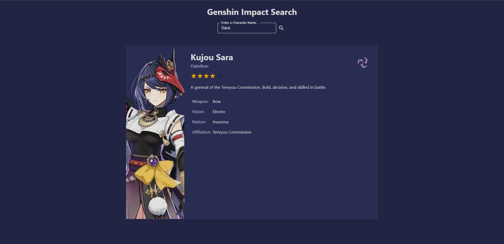
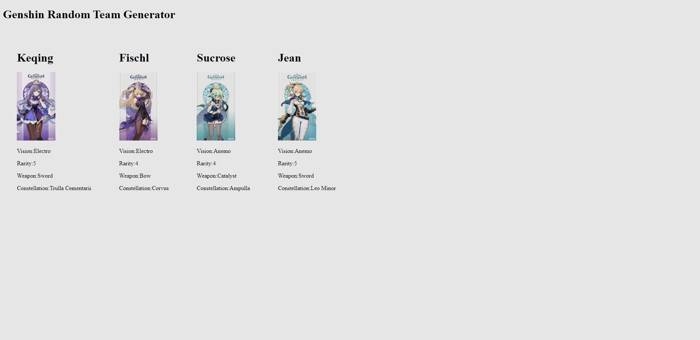

# MSA Phase 2 - Frontend

This project was bootstrapped with [Create React App](https://github.com/facebook/create-react-app).

## How to run:

In the project directory, you can run:

### `npm start` or  `yarn start`

# Genshin Impact Character Search

For this module, I decided to use a Genshin Impact API (Documentation [here](https://github.com/genshindev/api).)  
  
With this API, you can get the data of characters from the video game Genshin Impact. Using this data, I created a React Typescript web application that takes in user input (A characters name) and after clicking the search button, returns a card with the characters details on it. Below is an example of what the end product looks like:

  

      
# MSA Phase 2 - Backend
  # Genshin Team Randomizer API
This is an API that allows a user to generate a random team of Genshin Impact characters. In Genshin, a team comprises of 4 members. This API calls the [Genshin Impact API](https://github.com/genshindev/api) to get data for each character. To see the final result, you must call `https://localhost:{PORT}/Character/GetHTML`. This returns an HTML with your randomised team on it! Below is an example:  

## Section One  
To "demonstrate the differences between starting the project with one file over another", when running the project with `dotnet run --environment Development`, the API uses an InMemory database. When running the project with `dotnet run --environment Production`, the API uses an SQLite database.
  
After running the project with any of the two environments, call `https://localhost:{PORT}/Character/GetAPI` to add the character details from the Genshin API into the InMemory database. Next, call `https://localhost:{PORT}/Character/GetHTML` to get the final result.  
## Section Two  
In order to simplify my code and increase overall cleanliness, I used classes and interfaces to reduce the amount of duplicate code needed. I used folders to seperate "layers" of classes in order to increase cleanliness.  
  
The `Models` folder contains class definitions of Models used in my API. Definitions for the `Character` model are stored here and are used by the other layers  
  
The `Data` folder contains an interface (`ICharacterRepo.cs`) that defines the methods needed for the endpoints. `CharacterService.cs` implements the interface, containing the actual implementation of the methods which interact with the database. `CharacterDb.cs` contains the class that defines the DbContext.  
  
The `Controllers` folder contains the API controllers. The controllers call on the methods from `CharacterService.cs` to perform CRUD operations to the database.  
  
The structure goes from `Http request` -> `Controllers` -> `Data` when making API calls and reversed when returning the response.
## Section Three  
To "Demonstrate an understanding of why the middleware libraries made your code easier to test", I have used NUnit and Moq to make the process of unit testing easier. NUnit has tools designed specifically for testing. With the `Assert` class, I can easily compare results to their expected values to check if the endpoints are returning the correct results. With Moq, I can set up mock dependencies to facilitate the testing of my API controllers.
